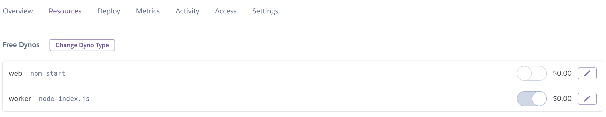

# Getting Started

This guide will help you get started with the project. It will also help you set up your own version of the HighTechU Discord Bot.

**HighTechU Students: Please remember that we are available to help at every step of the process. Let us know if you need help!**

## Development

Your development environment must have Git, Node.js, and npm installed. For more information about Git, visit "[Git](https://git-scm.com)". For more information about Node.js and npm, visit "[Node.js, and npm](https://nodejs.org/en/)".

You will need a text editor. Any text editor is fine, but we will be using VS Code. For more information about VS Code, visit "[Visual Studio](https://code.visualstudio.com)".

Lastly, you will need access to a terminal or command prompt. VS Code provides an integrated terminal for development. For more information about the Integrated Terminal, visit "[Integrated Terminal](https://code.visualstudio.com/docs/editor/integrated-terminal)".

Note: If you are using an online text editor / integrated development environment (Codespaces, Repl.it) you will most likely not need to download Git, Node.js, or npm.

> Optional: You may want to install the Heroku CLI to manually deploy the project with Heroku. For more information, visit "[Heroku CLI](https://devcenter.heroku.com/articles/heroku-cli)".

## Setup the Project in A Development Environment

You will need a GitHub account and read/write access to the repository.

Note: HighTechU Students working in a team will have read/write access to your team's project repository.

Note: You will also need admin access to the repository if you plan on automatically deploying the Discord Bot with Heroku. For more information, visit "[GitHub Integration](https://devcenter.heroku.com/articles/github-integration)".

> Note: HighTechU Students will need to ask an instructor for admin access to their project repository. Notably, HighTechU Students working in a team will require 1 team member to ask an instructor for admin access.

Note:

* You may want to fork the repository first if you do not have read/write access to the repository. For more information, visit "[Fork a repo](https://docs.github.com/en/github/getting-started-with-github/quickstart/fork-a-repo)".
* You may want to create a new repository using the HighTechU repository as a template. For more information, visit "[About Repository Templates](https://docs.github.com/en/github/creating-cloning-and-archiving-repositories/creating-a-repository-on-github/creating-a-repository-from-a-template#about-repository-templates)".

### Step 1: Open the terminal or command prompt and navigate to your development directory.

```bash
  # Example: Navigate to Your-Development-Folder
  # "cd" means Change Directory
  cd your-development-folder
```

### Step 2: Clone the project locally. For more information, visit "[Cloning a repository](https://docs.github.com/en/github/creating-cloning-and-archiving-repositories/cloning-a-repository-from-github/cloning-a-repository#cloning-a-repository)".

```bash
  # URL: Check which repository you are trying to clone. It may not be the one in the example below.
  git clone https://github.com/hightechu/hightechu-discord-bot.git
```

### Step 3: Navigate to the project directory.

```bash
  # Project Directory: Check the name of your repository. It may not be the one in the example below.
  cd hightechu-discord-bot
```

### Step 4: Switch to a new branch from `main`.

Note: It is important that developers do not work directly in the `main` branch. The `main` branch should remain stable.

```bash
  # Replace <branch_name> with the name of your new branch. 
  # Example: git checkout -b really-awesome-feature
  git checkout -b <branch_name>
```

### Step 5: Install the npm dependencies.

```bash
  npm install
```

### Step 6: Open the project in your preferred code editor.

```bash
  # Example: Open VS Code
  code .
```

## Setup Configuration

Before you can start with the project you will need to configure the environment variables. However, at this point in the guide we do not have our configuration variables. But we can set up the file now so that we can add the configuration variables to the `.env` file throughout the guide.

- [ ] Create an `.env` file based on `.env.example`. It should include all the content of `.env.example`.

We will be adding our secrets from Discord and Firebase into this file, and the file will not be uploaded to Git or GitHub, therefore your secrets will stay secret.

Note: The `.env` file will only be available in your local development environment. This means that each person working on the same project will need to create their own `.env` file with the appropriate contents. 

> Note: HighTechU Students working in a team will each need their own `.env` file, but the contents (the configuration variables) will be the same for everyone on the team.

## Account Requirements

To proceed with this project, you will need to have an account with the following services: Discord, Firebase, and Heroku.

Notes:
* HighTechU Students working in a team will require only 1 account per team for Firebase and Heroku.
* HighTechU Students working in a team will each need their own Discord account. But only 1 team member will need to set up the Discord Server and the main Discord Bot. Thus, you will need to designate 1 team member to manage the accounts, and provide the configuration variables.

### Discord - Personal

- [ ] Setup a Discord Account. For more information, visit "[Discord Getting Started](https://support.discord.com/hc/en-us/articles/360033931551-Getting-Started)".
- [ ] Download Discord. For more information, visit "[Download Discord](https://discord.com/download)".

### Discord - Server

- [ ] Setup a Discord Server. For more information, visit "[Create A Server](https://support.discord.com/hc/en-us/articles/204849977-How-do-I-create-a-server-)".
  - [ ] HighTechU Students: Invite your team members to the Discord Server. For more information, visit "[How do I invite friends to my server](https://support.discord.com/hc/en-us/articles/204155938-How-do-I-invite-friends-to-my-server-)".
  - [ ] HighTechU Students: Update your team members' server permission to admin. For more information, visit "[Setting Up Permissions FAQ](https://support.discord.com/hc/en-us/articles/206029707-Setting-Up-Permissions-FAQ)".

### Discord - Bot

- [ ] Setup a Discord Bot. For more information, visit "[Setting Up a Bot Application](https://discordjs.guide/preparations/setting-up-a-bot-application.html#creating-your-bot)". (Note: This guide is provided by Discord.js. Please only read the provided linked section).
- [ ] Add your Discord Bot to your server. For more information, visit "[Adding a Bot to Servers](https://discordjs.guide/preparations/adding-your-bot-to-servers.html)". (Note: This section requires your bot application's client ID. Please read the entire section carefully).
- [ ] Add your Discord Bot Token to `.env`. Obtain your bot token from the Discord Portal. For more information, visit "[Your Token](https://discordjs.guide/preparations/setting-up-a-bot-application.html#your-token)".

Add your Bot Token to the `TOKEN` configuration variable. Do not add any spaces between the configuration variable name (`TOKEN`) and the `=`.

`.env`
```bash
TOKEN=YOUR_VERY_SECRET_BOT_TOKEN
```

### Firebase

- [ ] Setup a Firebase Account. For more information, visit "[Google Firebase](https://firebase.google.com)".
- [ ] Setup a Firebase Project. Follow the "Get started" Guide. For more information, visit "[Products Build](https://firebase.google.com/products-build)".
- [ ] Create a Cloud Firestore within your Firebase Project. For more information, visit "[Firestore](https://firebase.google.com/docs/firestore)".
- [ ] Obtain your Firebase Project Config Variables. For more information, visit "[Config Object](https://firebase.google.com/docs/web/setup#config-object)".

Note: The code that will be provided for the Firebase Project Configuration Variables will be presented in a JavaScript script tag.

```js
<script>
  // Your web app's Firebase configuration
  var firebaseConfig = {
    apiKey: "SECRET",
    authDomain: "SECRET_LINK",
    projectId: "SECRET_ID",
    storageBucket: "SECRET_LINK",
    messagingSenderId: "SECRET",
    appId: "SECRET"
  };
</script>
```

However, we only want the `SECRET` part. Carefully copy and paste each part into the correct `.env` configuration variable. Do not add any spaces between the configuration variable name and the `=`.

`.env`
```bash
TOKEN=YOUR_VERY_SECRET_BOT_TOKEN
apiKey=SECRET
authDomain=SECRET_LINK
projectId=SECRET_ID
storageBucket=SECRET_LINK
messagingSenderId=SECRET
appId=SECRET
```

- [ ] Update Cloud Firestore Rules. For more information, visit "[Rules tab](https://firebase.google.com/docs/firestore/security/get-started#use_the_firebase_console)".

We will want to update the rules to allow for anyone to read and write. You can copy and paste the following code into the Rules Tab in the Cloud Firestore Tab.

```
service cloud.firestore {
  match /databases/{database}/documents {
    match /{document=**} {
      allow read;
      allow write;
    }
  }
}
```

Note: To learn more about Firebase and JavaScript visit the [documentation](https://firebase.google.com/docs/web/setup).

### Heroku

Note: HighTechU Students working in a team will need to designate 1 team member to manage the Heroku Application. You will need to inform an instructor of the designated team member. The student will then gain admin access to the team's project repository. This will allow them to set up automatic deployment.

- [ ] Set a Heroku Account. For more information, visit "[Heroku](https://www.heroku.com)".
- [ ] Create a new Heroku Application.
- [ ] Setup Deployment Method. Use the `Connect to GitHub` method and select the appropriate repository.
- [ ] Setup Configuration Variables. Add the configuration variables in the `.env` file to Heroku. For more information, visit "[Config Vars - Using the Heroku Dashboard](https://devcenter.heroku.com/articles/config-vars#using-the-heroku-dashboard)".
- [ ] Config Dynos. Turn off the `web` dyno and turn on the `worker` dyno.



Note: You will want to turn off the `worker` dyno when you are not using your Discord Bot. A free account has 550 free dyno hours each month, therefore use your hours appropriately.

- [ ] Enable Automatic Deployments. For more information, visit "[Automatic deploys](https://devcenter.heroku.com/articles/github-integration#automatic-deploys)".
- [ ] Deploy the `main` Branch Manually. For more information, visit "[Manual deploys](https://devcenter.heroku.com/articles/github-integration#manual-deploys)".

Note: The `worker` dyno will be re-deployed every time the `main` branch is updated. Therefore, check that your app runs locally before merging your working branch into the `main` branch.

## Locally Deploy

You will be able to deploy your Discord Bot locally. This is helpful for testing that your code works before adding it to the Git and GitHub Repository. You always want to make sure your code works as intended before merging it to the `main` branch.

Note: You will need to set up your own Discord Bot and add the Discord Bot to the team server to develop locally. You will need to follow the `Discord - Bot` instructions above.

> Setting up your own Discord Bot to develop locally is critical for preventing a bug where the bot runs commands multiple times.

Note: You will need your `.env` file correctly configured with the configuration variables to deploy locally.

Note: HighTechU Students working in a team can share the Firebase configuration variables while developing locally.

### Step 1: Start the server.

```bash
  npm run start
```

## Optional Configuration

These are optional configurations that you can perform to customize your Discord Bot.

### Prefix

You can update the prefix for interacting with your Discord Bot. Currently to interact with the Discord Bot you would type `!command`. However, you can instead configure the interaction to be `!bot command`. This is helpful if you have multiple Discord Bots in a server.

Note: HighTechU Students working in a team will want to change the Discord Bot prefix for each Bot in the server.

### Step 1: Update the prefix in the `config.json` file.

from 

```bash
# Prefix for Summoning your Discord Bot
{
  "prefix": "!"
}
```

to

```bash
# Prefix for Summoning your Discord Bot
{
  "prefix": "!bot "
}
```

## Deployment

The Discord Bot is set up with a Heroku Application that automatically deploys the `main` branch on update. Therefore, be careful updating the `main` branch.

Note: If you are using the Heroku CLI to manually deploy, you will need to follow the instructions provided by Heroku in the application dashboard. For more information, visit "[Git - For an Existing Heroku App](https://devcenter.heroku.com/articles/git#for-an-existing-heroku-app)".

## Testing the Bot

To test your setup, you can run the command `!ping` on your server. The Discord Bot will respond `Pong!` if your setup was a success.

Note: If you change your Discord Bot prefix, the command will no longer be `!ping`, but instead `!new-prefix ping`. 

> Note: This applies to both locally developed Discord Bot and Heroku developed Discord Bot.

### Problems?

Do not worry if your Discord Bot doesn't respond. Ask for help, and we can troubleshoot together to solve the problem. Check that your Discord Bot is running either locally (`npm run start`) or on Heroku. The Discord Bot will not work unless it is actively running.

Note: The Discord Bot must be added to your server, if it isn't added it can't listen and respond to commands.

## Conclusion

You can now start developing. If you have any questions, feel free to ask. We want you to succeed!
