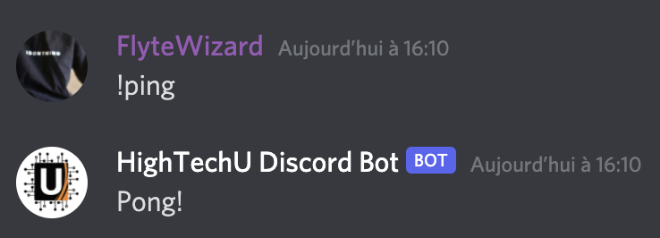

<!-- You will want to modify the image above to reflect your Discord Bot Branding. -->

## About

<!-- You will want to modify the text below to include your Discord Bot About. -->
<!-- You will want to modify the documentation link to reflect your Discord Bot Website. -->

Lorem ipsum dolor sit amet, consectetur adipiscing elit, sed do eiusmod tempor incididunt ut labore et dolore magna aliqua. Tortor vitae purus faucibus ornare suspendisse sed nisi lacus. Posuere lorem ipsum dolor sit. Quis varius quam quisque id diam vel quam elementum pulvinar. Rhoncus dolor purus non enim praesent elementum facilisis leo. Accumsan lacus vel facilisis volutpat est velit egestas dui. For more information about the commands visit the "[documentation](https://hightechu.ca)".

## Screenshots

<!-- You will want to modify the demo screenshot below to reflect your Discord Bot Usage. -->

## Technologies

The HighTechU Discord Bot uses the following technologies: Discord.js, Node.js, Firebase, Heroku, Bootstrap, and GitHub Pages.

## Getting Started

To get started with the project visit the [`getting started`](GETTING_STARTED.md) documentation. The document outlines how to get a copy running locally/publicly and how to setup the discord bot.

## Contributing

Contributions are always welcome!

See [`CONTRIBUTING`](.github/CONTRIBUTING.md) for ways to get started.

Please adhere to this project's [`code of conduct`](CODE_OF_CONDUCT.md).

## Documentation

To get started with the projects website visit the [`getting started website`](GETTING_STARTED_WEBSITE.md) documentation. The document outlines how to get started with your projects website and how to deploy with GitHub Pages.

<!-- You will want to modify the documentation link to reflect your Discord Bot Website -->

[Documentation](https://hightechu.ca)

## Useful Links

* [Discord Developer Portal](https://discord.com/developers/applications)
* [Discord Permissions Calculate](https://discordapi.com/permissions.html)
* [Firebase Console](https://console.firebase.google.com)
* [Heroku](https://www.heroku.com/)

## Learning Resources

* [Discord.js Documentation and Guide](https://discordjs.guide/)
* [Discord Documentation](https://discord.com/developers/docs/intro)
* [Firebase Web Setup](https://firebase.google.com/docs/web/setup)
* [Firebase Documentation](https://firebase.google.com/docs/build)
* [Heroku Documentation](https://devcenter.heroku.com/categories/reference)

## License

The project uses the [MIT LICENSE](https://choosealicense.com/licenses/mit/).

## Authors

<!-- You will want modify the authors list below to include all contributing team members. -->

- [@hightechu](https://github.com/hightechu)
